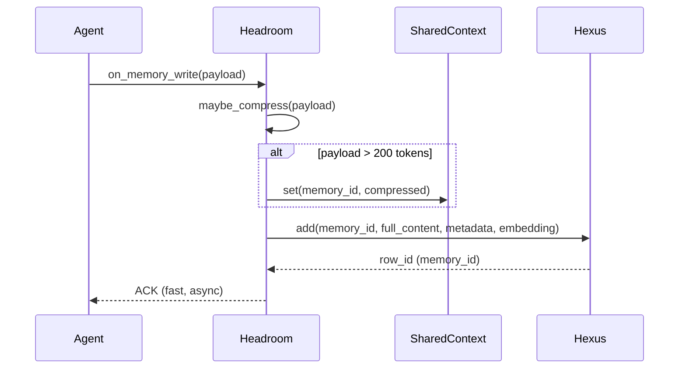
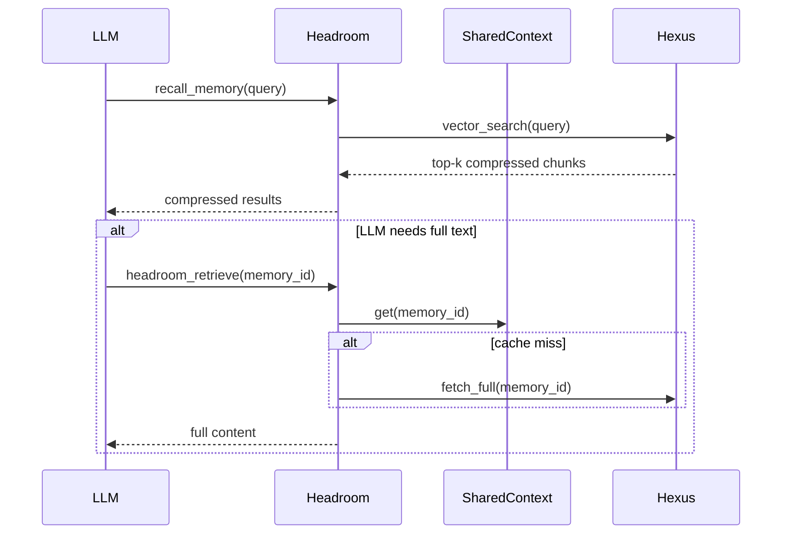

# Headroom Integration and Enhancements

## Overview
This document describes how to integrate **Headroom** (intelligent compression, reversible storage, provenance, shared‑context, and deduplication) with the existing **Hexus** memory plugin. The goal is to give agents a **low‑token short‑term view** (Headroom) while retaining a **rich, searchable long‑term store** (Hexus or any MCP vector backend).

---

## 1️⃣ Architecture Diagram
```mermaid
flowchart TD
    AgentA -->|writes| Headroom[Headroom CCR (proxy)]
    AgentB -->|writes| Headroom
    Headroom -->|compressed chunk| SharedContext[SharedContext Cache]
    Headroom -->|full payload| Hexus[Hexus Postgres store]
    Headroom -->|full payload| MCP[Other MCP vector store]
    AgentA -->|recalls| Headroom -->|short chunks| LLM
    LLM -->|needs details| CCR_Tool[headroom_retrieve]
    CCR_Tool --> Hexus -->|full content| AgentA
    CCR_Tool --> MCP -->|full content| AgentB
```

- **Write path** – Agents write through Headroom. If the payload > 200 tokens, it is compressed, stored in `SharedContext`, and the original is forwarded to the downstream vector store (Hexus or MCP).
- **Read path** – LLM receives only the compressed snippets. If it asks for more detail via `headroom_retrieve`, Headroom pulls the original from the underlying store.

---

## 2️⃣ Core Enhancements to Hexus
| Feature | Why it matters | Implementation notes |
|---|---|---|
| **Pre‑processing pipeline** | Cleaner embeddings → better recall | Add `hexus/pipeline/router.py` that wraps Headroom’s `ContentRouter`. Only compress if `len(text) > 200 * 4` (≈ 200 tokens). |
| **Reversible storage (CCR)** | LLM sees tiny chunks, can fetch full text on demand | Store the compressed version in a CCR cache keyed by the `memory_id` returned from the DB. |
| **Provenance metadata** | Auditing & cross‑agent debugging | Extend `MemoryStore.add` to accept `metadata` with fields `provenance`, `importance`, `confidence`, `source_tool`. Persist as JSONB. |
| **Cross‑agent deduplication** | Avoid duplicate facts across themes | Compute SHA‑256 of the **compressed** text. If a row with the same hash exists for the same `agent_identity`, skip insert and append provenance. |
| **Hybrid relevance scoring** | Improves recall precision | Implement `hexus/relevance/hybrid_score.py` using:
  `final = 0.6 * vec_score + 0.3 * bm25_score + 0.1 * recency_score`
  (default weights can be tweaked via config). |
| **Intelligent context window fitting** | Guarantees returned memories fit within LLM token budget | Add `hexus/relevance/ranking.py` that trims low‑score items until `max_tokens` is satisfied. |
| **Reflection / learning loop** | Self‑improvement after failures | Expose a `memory_reflect` tool that extracts a concise lesson from an exception and stores it with high `importance`. |
| **Modular architecture** | Future‑proof, easy to swap backends | Keep pipeline, storage, and relevance layers separate, mirroring Headroom’s design. |

---

## 3️⃣ Detailed Data Flow
### 3.1 Write / Store Path

- The **worker** for `AsyncWriter` performs the compression, embedding (on compressed text if desired), and inserts into Postgres.
- The **CCR cache** holds the short version for instant retrieval.

### 3.2 Read / Retrieve Path

- The **CCR tool** (`headroom_retrieve`) first checks the local cache; if missing, it fetches the original from the downstream store.

---

## 4️⃣ Repository Layout Changes
```
hexus/
├─ pipeline/
│   └─ router.py               # wrapper around Headroom ContentRouter
├─ ccr/
│   └─ cache.py                # simple in‑memory cache keyed by memory_id
├─ relevance/
│   ├─ hybrid_score.py         # vec + BM25 + recency scoring
│   └─ ranking.py              # token‑budget trimming
├─ utils/
│   └─ metadata.py             # helpers to build provenance dicts
├─ writer.py                  # async writer now calls maybe_compress & stores CCR key
├─ store.py                   # add `compressed` and `content_hash` columns handling
└─ README.md                  # link added (see below)
```
All new modules are **pure‑Python** and have zero runtime overhead when the compression branch is not taken.

---

## 5️⃣ Database Migration
Create a migration `hexus/migrations/003_enhancements.sql`:
```sql
ALTER TABLE memory_entries
  ADD COLUMN compressed TEXT,
  ADD COLUMN content_hash BYTEA;

CREATE INDEX IF NOT EXISTS idx_memory_compressed_fts
  ON memory_entries USING gin(to_tsvector('english', compressed));
```
- `compressed` holds the short version (used by CCR).
- `content_hash` stores the SHA‑256 of the compressed text for deduplication.
- GIN index enables fast BM25‑style keyword search on the short version.

---

## 6️⃣ Configuration (`$HERMES_HOME/config.yaml`)
```yaml
plugins:
  hexus:
    dsn: "dbname=hermes_memory user=hermes host=/var/run/postgresql"
    embed_url: null
    embed_model: "sentence-transformers/all-MiniLM-L6-v2"
    prefetch_limit: 5
    min_similarity: 0.30
    embed_on_write: true
    scope_default: "current"
    embed_eager_load: false
    compression:
      threshold_tokens: 200            # compress only if > 200 tokens
    deduplication:
      similarity_threshold: 0.95       # embedding‑based dedup check
      hash_enabled: true
  headroom:
    compression:
      enabled: true
      handlers: [code, log, json]
    ccr:
      enabled: true
    shared_context:
      enabled: true
    deduplication:
      similarity_threshold: 0.95
```
The same config file can be shared across agents; each agent can override `agent_identity` via the `X-Hermes-Session-Key` header or the `HEXUS_AGENT_IDENTITY` environment variable.

---

## 7️⃣ Testing Strategy
1. **Unit tests** for `router.maybe_compress` (both below and above the 200‑token threshold).
2. **Integration test** that:
   - Writes a > 200‑token log entry via the Hermes plugin.
   - Asserts a row exists in `memory_entries` with `compressed` populated and `content_hash` set.
   - Calls `headroom_retrieve(memory_id)` and checks the returned full text matches the original.
3. **Dedup test** – write the same payload from two different agents; ensure only one DB row is created and both agents appear in the provenance list.
4. **Hybrid scoring test** – verify that a query returns higher‑ranked results when vector similarity and BM25 agree.

---

## 8️⃣ Impact on Existing Agents & MCP Stores
- **Zero breaking change** – existing `memory_store` and `recall_memory` tools continue to function. The new compression step is transparent.
- **Cross‑agent sharing** – because deduplication runs *before* any store insert, duplicate facts are eliminated *globally* (across Hexus and any MCP backend you point Headroom at).
- **CCR bridge** works with **any** MCP vector store: Headroom only needs a `fetch_by_id` implementation, which all MCP servers already expose.
- **Performance** – the async writer ensures the agent thread never blocks on embedding or DB I/O. Compression is cheap (regex‑based) and only applied to large payloads.

---

## 9️⃣ Visual Summary
```mermaid
graph LR
    A[Agent] -->|writes| B[Headroom CCR]
    B --> C[Compressed Cache]
    B --> D[Hexus Postgres]
    B --> E[Other MCP Store]
    A <--|recalls| B
    B --> F[LLM (short view)]
    F -->|detail request| G[headroom_retrieve]
    G --> C
    G -->|fallback| D
    G -->|fallback| E
```

---

## 10️⃣ Next Steps for the Repository
- Add the new modules (`pipeline/router.py`, `ccr/cache.py`, `relevance/*`, `utils/metadata.py`).
- Apply the migration script (`hexus/migrations/003_enhancements.sql`).
- Update `writer.py` to call the new router and store CCR keys.
- Extend the test suite under `tests/`.
- Run the full CI pipeline to validate against both the Hermes plugin surface and the MCP server.

---

## 11️⃣ Reference Links
- **Headroom repo** – https://github.com/headroom-ai/headroom (see `headroom/compression/ContentRouter`, `headroom/ccr/`).
- **Hexus README** – now contains a link to this integration guide (see below).

---

*Prepared by Antigravity – your agentic coding partner.*
