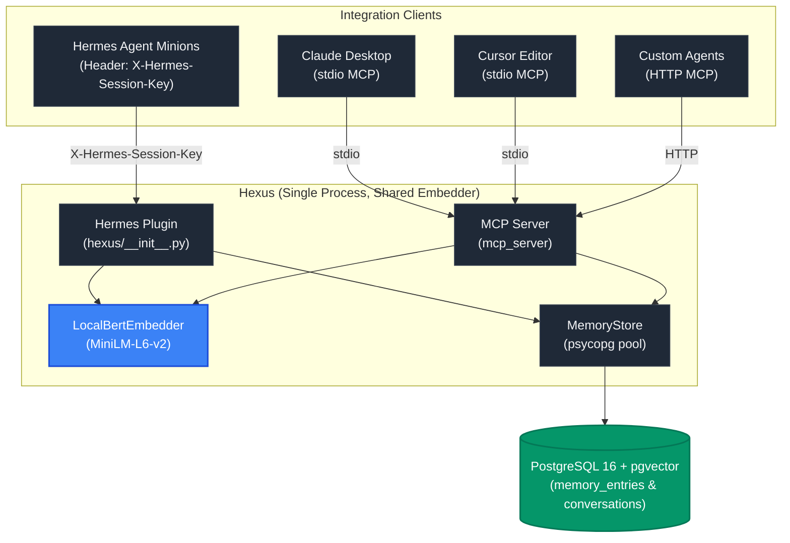

# Hexus 🧠
[](https://github.com/codenamekt/hexus/actions/workflows/ci.yml) [](https://badge.fury.io/py/hexus)
### Postgres-Powered Vector Memory for the Agentic Age

**Postgres + hexus memory substrate for [hermes-agent](https://github.com/NousResearch/hermes-agent) AND a standalone Model Context Protocol (MCP) server for any client (Claude Desktop, Cursor, fleet agents, etc.).** 



---

## 🚨 The "Memory Crisis" (And Why Hexus Rocks 🎸)

If you've ever tried running a team of cooperating agents, you've probably hit one of these roadblocks. Here's why Hexus exists and how it changes the game:

*   **The Stomping Minions 🐘**: Say goodbye to local markdown files that get overwritten when you run multiple agents. Hexus gives every minion a clean, scoped memory space ("themes"). Your marketing agent's notes won't contaminate your trading agent's data!
*   **Pure Vector Speed (No LLM in the Hot Path!) ⚡**: Embedding search should be pure vector math! We use a purely local BERT model. Zero cloud calls, zero LLMs in the hot path, absolute privacy, and *way* faster performance.
*   **Ditch the Cloud Monoliths ☁️**: Other memory providers require paid cloud services and route every read/write through an LLM. Not us. Hexus uses your existing Postgres + `pgvector`. Keep it simple, keep it fast!
*   **Storage Layer AND Memory Model 📦**: Hexus acts as a rock-solid storage backbone *and* an intelligent memory model for a fleet of cooperating agents, keeping everything centralized, searchable, and clean.
*   **Standalone Plugin Power 🧩**: Why a standalone plugin? So you can just drop it in and go! No waiting for upstream PRs in the main repositories.

## 🌪️ Getting Started (Installation is a breeze!)

Ready to try it out? You can get up and running in a snap.

### Option 1: Hermes Plugin (via pip)
If you're integrating directly into a Hermes agent, you can grab it from pip:

```bash
pip install hexus
```
*Note: Once installed, just point Hermes to it! You can also just drop the `hexus` module files straight into your `~/.hermes/plugins/hexus/` directory. Hermes's discovery system will automatically pick it up and initialize it on startup!*

**Configuration (`hermes.yaml`):**
When running as a Hermes plugin, configure it directly in your `hermes.yaml` file (not via environment variables):

```yaml
plugins:
  memory:
    provider: hexus
    config:
      # The Postgres connection string (required)
      dsn: "dbname=hermes_test user=postgres password=postgres_secret host=localhost"
```

### Option 2: Docker & MCP Server (Claude, Cursor, etc.)
The easiest way to run the standalone MCP server is via Docker (GHCR). 

> **Note:** The Docker MCP server requires a running PostgreSQL database with `pgvector` enabled. You can reference or use our provided `docker/compose.yml` file as a quick example to spin one up!

**Environment Variables:**
When running via Docker or as a standalone MCP server, you can pass the following environment variables:
* `HEXUS_DSN` - The Postgres connection string (e.g., `dbname=hermes_test user=postgres password=secret host=pg`).
* `HEXUS_DB_PASS` - Used by our `compose.yml` to set the Postgres password (and the default DSN's password).
* `HEXUS_TRANSPORT` - MCP transport: `"stdio"` (default) or `"http"`.
* `HEXUS_AGENT_IDENTITY` - Default agent identity for tool calls that don't supply one (default: `"default"`).
* `HEXUS_MEMORY_ISOLATION` - Multi-agent read isolation: `"shared"` (default) lets any agent recall/search/read every agent's memory — a single shared knowledge base for a trusted fleet; `"strict"` scopes reads to the calling agent's own identity. Cross-agent **mutations** (confirm/reject/remove/forget/summarize by id) are always scoped to the caller in **both** modes. On the HTTP transport the caller's identity is taken server-side from the `X-Hermes-Session-Key` header and overrides any client-supplied `agent_identity`, so an authenticated client cannot act as another agent.
* `HEXUS_EMBED_EAGER_LOAD` - Set to `"1"` to pre-load the local embedding model at startup (saves ~1-2s on first use).
* `HEXUS_EMBED_DEVICE` - Torch device for the embedder (default: `"cpu"`).
* `HEXUS_WEBHOOK_URL` / `HEXUS_WEBHOOK_SECRET` - (Optional) POST a signed webhook on memory writes.

The easiest way to bring up Postgres **and** the MCP server together is the `mcp` profile in our compose file:

```bash
# Set the DB password first (used for both Postgres and the MCP server's DSN)
export HEXUS_DB_PASS=postgres_secret

# Starts pgvector + the MCP server (HTTP streamable transport on container port 8000)
docker compose -f docker/compose.yml --profile mcp up
```

> The MCP server port is `expose`d on the internal Docker network, not published to your host. To reach it from the host (e.g. on `localhost:8000`), uncomment the `ports:` mapping under the `mcp` service in `docker/compose.yml`.

**Using it with Claude Code / Claude Desktop:**
If you want to plug Hexus straight into your Claude `claude_desktop_config.json` via standard `stdio`, add this block. It runs the server binary directly (via `--entrypoint`, so it talks clean JSON-RPC on stdio without the container's startup logging), pointed at your already-running Postgres:

```jsonc
{
  "mcpServers": {
    "hexus": {
      "command": "docker",
      "args": [
        "run",
        "-i",
        "--rm",
        "--entrypoint",
        "hexus-mcp",
        "ghcr.io/codenamekt/hexus:latest",
        "serve",
        "--transport",
        "stdio",
        "--dsn",
        "dbname=hermes_test user=postgres password=postgres_secret host=host.docker.internal"
      ]
    }
  }
}
```

> This expects the schema to already exist (the compose `mcp`/`test` profiles apply the migrations). It connects to a Postgres reachable at `host.docker.internal` — adjust the `--dsn` host/password for your setup.

## 🏎️ Look at This! Ridiculously Fast Benchmarks
We believe in speed. Check out these actual benchmarks running on a basic CPU (no GPU needed!):

*   **Single Embed Latency**: `7.4 ms`
*   **Batch Embed Throughput**: `1,486 items/sec` (batch size 32)
*   **Recall Latency (Top 5)**: `2.0 ms`

Wanna run these yourself? Check out the full [BENCHMARK.md](docs/BENCHMARK.md) to see how!

## ✨ Wait... There's More! (Features)

*   **Two Integration Paths, One Shared Store**: Use it as a Hermes plugin, OR run it as a standalone Model Context Protocol (MCP) server for Claude Desktop, Cursor, and custom agents.
*   **Built-in Power-Ups**: Hybrid search (BM25 + vector), temporal decay, TTL/memory forgetfulness, entity tagging, and conversation summaries.
*   **Potato-Friendly**: Runs entirely local on a CPU (e.g. an old Intel NUC or mini PC).

## 🕳️ Digging Deeper

Looking for the nitty-gritty details? We moved the heavy technical stuff into their own docs so you can get straight to the code:

*   📖 [Technical Details & Configuration](docs/TECHNICAL_DETAILS.md) - Admin DB commands, schemas, hooks, and MCP configuration.
*   🗺️ [Roadmap](docs/ROADMAP.md) - See where we've been and what wild features are coming next.
*   🔙 [Rollback Guide](docs/ROLLBACK.md) - In case you change your mind (but you won't!).

---
*License: [BSD 3-Clause](LICENSE)*
